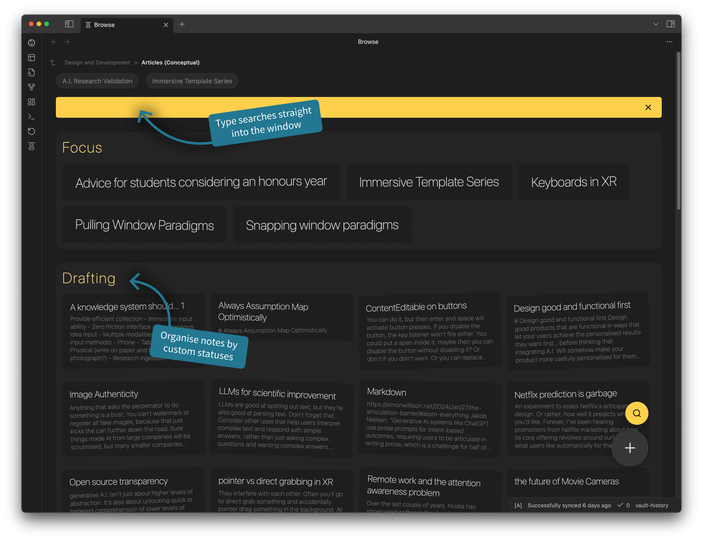

# Obsidian Project Browser
A plugin for [Obsidian](https://obsidian.md) that replaces your new tab window with a card layout of the files in each folder organised by state. The view is filterable with an inbuilt search field (just start typing!), and files can be assigned a state from a prominent menu within the note.

## 📓 Development Diaries
I record regular development diaries. [Subscribe and follow along](https://www.youtube.com/@designdebtclub) to see features in development.

    <a href="https://youtube.com/playlist?list=PLAiv7XV4xFx3_JUHGUp_vrqturMTsoBUZ&si=7-XnA3NEq6OBNzhW" target="_blank">
         
        Click to vew development diaries
    </a>

  
  
  
  

## 🗺️ Rough roadmap
I've been building this plugin since March 2023 and I'm regulaly developing it further and using it daily myself. 
Below are the high level features in my current development plan along with when they'll likely get implemented.

Historical

- ✅ Show files as cards.
- ✅ Folder navigation.
- ✅ Organisation by states.
- ✅ Easy note state menu.
- ✅ Back/forward navigation with memory.
- ✅ Adapt to light/dark modes.
- ✅ Enable customising states.
- ✅ Right click actions.
- ✅ Hide individual folders.
- ✅ Customise launch folder.

Current feature focus

- [ ] Folders as projects.
- [ ] Multi-page project support.
- [ ] Reordering notes.
- [ ] Prioritisation of notes.

## ⚠️ Be careful
>As with most Obsidian plugins, this is a free gift to the community, provided 'as is' to help you out. While I'm doing my best to make it awesome (And I love feedback), there are always chances things might not work quite right. To be safe, **please always back up your files**.

## 🪳 Report a bug
Found something that's not quite working right or do you have a feature request? Don't be shy, feel free to make some noise over on the [GitHub Issues](https://github.com/daledesilva/obsidian_project-browser/issues) page. But be sure to check if someone has already posted the same issue and comment on theirs if they have.

## 💾 Installation
You can find this plugin in the plugin directory within Obsidian.

Click for help installing plugins

1. Open your Obsidian vault and go to **Settings**.

2. Click on **Community Plugins** in the side bar.

3. If you haven't already, you will need to turn on community plugins.

4. Search 'Dale de Silva' and install **Project Browser**.

If you would like to install new versions of the plugin that are still being tested, you can install this plugin through BRAT instead.
BRAT is another community plugin that allows you to install a Beta version. New features are released as a Beta version first and can take from a few days to a month before landing in the standard version.

Click for Beta version installation instructions

1. Open your Obsidian vault and go to **Settings**.
2. Click on **Community Plugins** in the side bar.
3. Turn on community plugins and click **Browse**.
4. Search and install **BRAT**.
5. Scroll down and **activate** BRAT.
6. In the BRAT menu in the side pane, select **Add Beta Plugin**.
7. Follow the instructions presented.
8. When a URL is requested, use: `https://github.com/daledesilva/obsidian_project-browser/`

Click for Beta version update instructions

- BRAT is set to update Beta plugins by default on startup, however, this can sometimes take some time.
- To force an update, run BRAT's Obsidian commnd `Choose a single plugin to update` and choose Project Browser.

## ❤️ Support
If you find this plugin saves you time or helps you in some way, please consider supporting my development of plugins and other free community material like this.

  
  
  
  
  

## 🤖 My other work
You can find links to my other projects on [designdebt.club](https://designdebt.club), where I blog about design and development, as well as release other plugins like this one. You can also find my writing at at [falterinresolute.com](https://falterinresolute.com) where I combine philosophy and animation.

  
  

