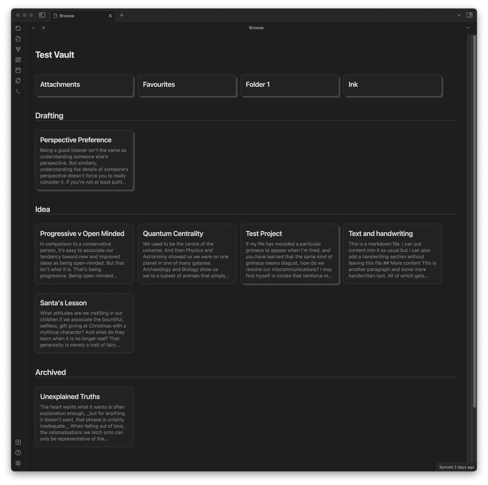
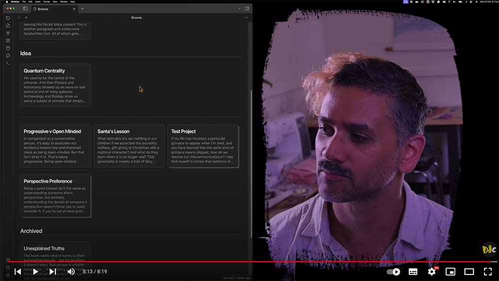
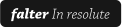

# Obsidian Project Browser
A plugin for [Obsidian](https://obsidian.md) that replaces your new tab window with a browseable layout of the files and folders in your vault.

>**Please note that this plugin is in an *ALPHA* state.** 
This means that it has been released before all of it's features have been developed or properly tested. 
You can learn about what's done and what's on the roadmap below.

## 📓 Development Diaries
I record regular development diaries. [Subscribe and follow along](https://www.youtube.com/@designdebtclub) to see features in development.

    <a href="https://youtube.com/playlist?list=PLAiv7XV4xFx3_JUHGUp_vrqturMTsoBUZ&si=7-XnA3NEq6OBNzhW" target="_blank">
         
        Click to vew development diaries
    </a>

  
  
  
  

## 🗺️ Rough roadmap
Below are the high level features in my current development plan along with when they'll likely get implemented.

### February 2024 (Core functionality)
- Show files & folders as cards. ✅
- Navigation between folders. ✅
- Sectioning by states. ✅
- Easy state menu. ✅

### March 2024 (Basic functionality)
- Adapt to light/dark modes. ✅
- Add new file button. 🚧 ***(Next release)***
- Card actions from in browser view (set state, delete, etc).
- Remember last folder & consistent navigation.
- Rework multi-page project setup.

### April 2024 (Customisation & styling)
- Show non markdown files.
- Custom folder hiding.
- Enable customising states.
- Enable customising visible file types.
- Access via action or new tab setting.
- Custom view modes per section.

### May 2024 (Styling & accessibility)
- Refine styling and responsivity.
- Transition animations.
- Accessibility refinement.

### Future possibilities
- Set card priorities.
- Live filtering of cards.
- Scale settings.
- Card colours.
- Custom sectioning (ie. by date, by tags).
- Multi-select / Batch edits.

## 🪳 Report a bug
Found something that's not quite working right or do you have a feature request? Don't be shy, feel free to make some noise over on the [GitHub Issues](https://github.com/daledesilva/obsidian_project-browser/issues) page. But be sure to check if someone has already posted the same issue and comment on theirs if they have.

## Installation
You can find this plugin in the plugin directory within Obsidian.

Click for help installing plugins

1. Open your Obsidian vault and go to **Settings**.

2. Click on **Community Plugins** in the side bar.

3. If you haven't already, you will need to turn on community plugins.

4. Search and install **Project Browser**.

## ❤️ Support
If you find this plugin saves you time or helps you in some way, please consider supporting my development of plugins and other free community material like this.

  
  
  
  
  

## 🤖 My other work
You can find links to my other projects on [designdebt.club](https://designdebt.club), where I blog about design and development, as well as release other plugins like this one. You can also find my writing at at [falterinresolute.com](https://falterinresolute.com) where I combine philosophy and animation.

  
  

