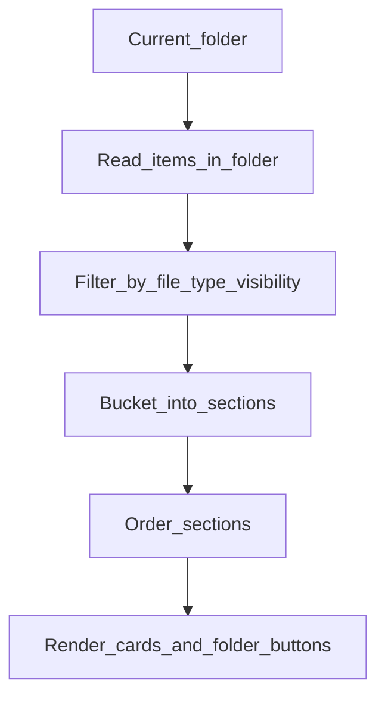
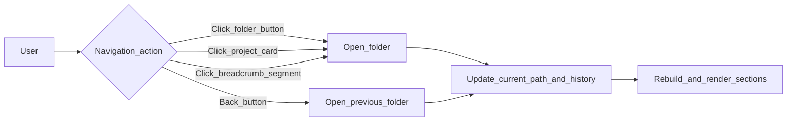

# Card Browser and navigation

This page explains the **Card Browser**: how it decides what to show, how navigation works, and how search changes what you see.

## Why it exists

The Card Browser is the “home screen” experience of Project Browser. It’s the thing you see when:

- you open a new tab and new-tab replacement is enabled, or
- you open Project Browser from the command palette/ribbon

Understanding the Card Browser clarifies how the plugin wants you to move through your vault: **one folder at a time, grouped into meaningful sections.**

## Conceptual understanding

### You are always “in a folder”

The Card Browser is always showing the contents of exactly one folder (the “current folder”):

- The **breadcrumb/path bar** tells you where you are.
- The **back button** returns you to the previous folder you visited in the Card Browser.

This is intentionally similar to browsing in a file manager, but with a key difference: items are **grouped into sections by state**.

### What you see is built from three section types

Within the current folder, items appear in three conceptual groups:

- **Folders section**: navigable subfolders (except those marked as projects).
- **State sections**: notes and projects with a visible state, grouped under that state heading.
- **No status**: notes and projects without any state.

If you’ve never assigned states before, you’ll mostly live in **Folders** and **No status**.

### Projects are folders that appear as cards

A project is still a folder, but it is displayed among notes as a card (and can have a state). Clicking a project card navigates “into” that folder just like clicking a folder.

For more on that concept, see [Projects](projects.md).

## Flows

### Build the view for the current folder

At a high level:

- Files and folders are collected from the current folder.
- File type visibility rules decide which files are eligible to appear.
- Eligible items are bucketed into sections (folders / state / no status).
- Sections are ordered using the configured state order.

Related concept docs:

- [States and sections](states-and-sections.md)
- [File type visibility](file-type-visibility.md)

### Navigation inside the Card Browser

In practice, you’ll most often navigate by:

- clicking a folder button
- clicking a project card
- clicking an earlier breadcrumb segment to jump “up”
- using the back button after exploring a branch

### Search: filter what’s already in view

Search in the Card Browser is scoped to the **current folder view**:

- it filters items (and may hide whole sections that have no matches)
- it does not “walk” the entire vault (it’s not global search)

This makes it feel like “find what I can see here”, rather than “find anything anywhere”.

## Technical details

- Section building happens via `getSortedSectionsInFolderAsync` in `src/logic/folder-processes.ts`.
- Section ordering and hidden-state filtering happen via `orderSections` in `src/logic/section-processes.ts`.
- Navigation updates the Card Browser view state with history so back/forward behaves like “folder history” within the Card Browser.

## Technical gotchas

- **Project settings files are excluded**: the file that stores project metadata (inside a project folder) is intentionally not shown as a card.
- **Empty folders are valid**: you can navigate into (and even mark) empty folders; they’ll simply render with no cards.
