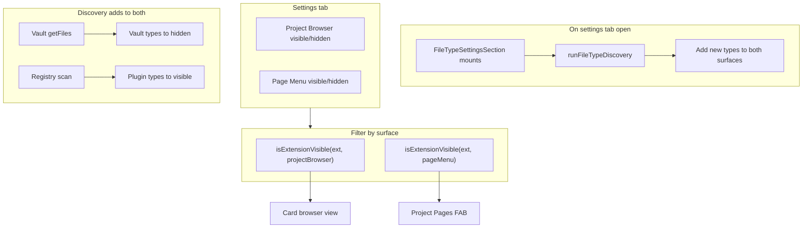

# File Type Visibility

Reference for how file type visibility controls what appears in the project browser view and the project pages menu.

## Why it exists

By default, the project browser shows all file types that Obsidian natively supports (notes, canvas files, PDFs, images, audio, video, etc.). File type visibility lets you hide file types you do not want to see in the browser or the pages menu—for example, plugin-generated JSON files, config files, or other auxiliary formats.

## Conceptual understanding

- **Visible file types** — Extensions in this list are shown in the surface (Project Browser or Page Menu). Each surface has its own visible list.
- **Hidden file types** — Extensions in this list are suppressed for that surface. Each surface has its own hidden list.
- **Unsupported file types** — A display category for extensions in hidden that are not in Obsidian's view registry (vault-scanned types). They are stored in hidden and derived at render time.

Project Browser and Page Menu each have separate visible and hidden lists, so you can control what appears in the card view differently from what appears in the pages menu.

### Unsupported types and external-open indicator

File types that Obsidian does not natively support (not in the view registry) open in the system default application when clicked. When such types are visible in the Project Browser or Page Menu, an external-link icon appears to indicate that clicking will open them in an external program. The icon appears at the top right of browser cards and next to the file type tag on page menu buttons.

## Three sections and color coding

The File Type Editor groups extensions into three categories, each with a distinct color:

| Section             | Source                                         | Color     | Description                                               |
| ------------------- | ---------------------------------------------- | --------- | --------------------------------------------------------- |
| Obsidian default    | Registry-derived (view metadata, no pluginId)  | Primary   | Built-in types (md, canvas, base, pdf, png, etc.)         |
| Obsidian registered | Registry-derived (view metadata has pluginId)  | Tertiary  | Plugin-registered (excalidraw, kanban, etc.)              |
| Unsupported         | Derived from `hidden` (extensions not in registry) | Secondary | From vault scan; types Obsidian does not natively support |

A legend above the file type sections shows sample chips in each color. The **Hidden** section displays all hidden types (including vault-scanned types), with distinct colors for registry-known vs unsupported. New vault extensions are auto-added to hidden on mount.

## Flows and relationships

## Using file type visibility

### Default visible file types

Default visibility differs by surface:

- **Project Browser** — All Obsidian native formats visible: Note (`.md`), Canvas (`.canvas`), Base (`.base`), PDF, images, audio, video, etc.
- **Page Menu** — Only Note (`.md`), Canvas (`.canvas`), and Base (`.base`) are visible by default. PDF, images, audio, video, and all other types start in Hidden. Users can move types to Visible as needed.

### Auto-detect on settings open

When you open the File Type settings tab, the editor automatically discovers Obsidian-registered extensions (from `viewRegistry.typeByExtension`) and adds any that are not already known to the **Visible** list in both Project Browser and Page Menu. It also scans the vault and adds any new extensions not already known to the **Hidden** list in both surfaces. This ensures newly enabled plugins' file types appear without manual action.

### Per-surface settings

The settings tab shows two sections: **Project Browser** and **Page Menu**. Each has its own Visible and Hidden lists. Drag file types between Visible and Hidden within a section to control what appears in that surface. The Hidden section displays all hidden types for that surface, with distinct colors for native/plugin vs vault-scanned (unsupported).

### Scan for new file types

On mount, the editor scans the vault for unique extensions and adds any not already known to the **Hidden** list in both Project Browser and Page Menu. Newly discovered types appear in the Hidden section with the unsupported (secondary) color. Drag them to Visible in either surface if you want to show them there.

### Add plugin-registered types

On mount, the editor discovers Obsidian-registered extensions (from `viewRegistry.typeByExtension`) and adds any not already known to the **Visible** list in both Project Browser and Page Menu. This ensures newly enabled plugins' file types appear without manual action.

### Display names

Only **Note** (`.md`), **Canvas** (`.canvas`), and **Base** (`.base`) use pretty display names. All other extensions are shown as `.ext` (e.g. `.pdf`, `.png`).

### Chip display (visible and hidden)

All file type chips show the display name (or `.ext`) on the first line. For plugin-registered types, the registering plugin name is shown on a second line (e.g. "via Excalidraw") when Obsidian's view registry exposes it. Hidden file types additionally show the extension when a pretty name exists (Note, Canvas, Base).

## Technical implementation

- **Settings**: `plugin.settings.fileTypes.projectBrowser` and `plugin.settings.fileTypes.pageMenu`, each with `visible` and `hidden` (string arrays of extensions).
- **Filter**: `isExtensionVisible(extension, surface)` in `src/logic/file-type-filter.ts` — returns `true` only when the extension is in that surface's visible list.
- **Project browser**: `getSortedSectionsInFolder` and `getSortedSectionsInFolderAsync` in `src/logic/folder-processes.ts` use `isExtensionVisible(ext, 'projectBrowser')`.
- **Pages menu**: `ProjectPagesFAB` in `src/components/project-pages-fab/` uses `isExtensionVisible(ext, 'pageMenu')`.
- **File type editor**: `FileTypeSettingsSection` runs discovery on mount; `FileTypeEditor` (one per surface) renders visible and hidden sections with ReactSortable for drag-and-drop, plus a shared legend and color-coded chips. Each surface uses a separate ReactSortable `group` so items cannot be dragged between Project Browser and Page Menu.
- **External-open indicator**: `isExtensionUnsupportedByObsidian(extension)` in `src/logic/is-extension-unsupported.ts` — returns `true` when the extension is not in Obsidian's view registry. When true, `NoteCardBase` and `ProjectPagesFAB` render an external-link icon to indicate the file will open in the system default application.
- **File card context menu** (`src/context-menus/file-context-menu.tsx`): Right-click options vary by file type. Notes (`.md`) get the full menu: Open in new tab, Priorities, States, Rename, Delete. Obsidian-supported non-notes (`.canvas`, `.base`, PDF, images, etc.) get Open in new tab, Rename, Delete—no Priorities or States, since those use YAML frontmatter that only markdown supports. Unsupported file types (those that open externally) get only Rename and Delete, since "Open in new tab" would open them in the system default app rather than in Obsidian.

## Technical gotchas

- Extensions are compared case-insensitively.
- `.pbs` (project settings) is in the default hidden list and never appears in the browser or pages menu.
- The scan excludes empty extensions and `.pbs`.
- Auto-detect runs when the settings tab mounts and adds new types to **both** surfaces; plugins that register later may require reopening settings.
- `getRegisteredExtensionsFromApp` reads from Obsidian's internal view registry (`viewRegistry.typeByExtension`), which is undocumented. If the registry is inaccessible, it falls back to a minimal set (`md`, `canvas`, `base`). If Obsidian changes this structure in a future version, the registry-based logic may need adjustment.
- Native vs plugin (default vs registered) is derived at runtime: view metadata is checked for `pluginId`; if present, the extension is plugin-registered.
- Plugin attribution (e.g. "via Plugin Name") on chips probes `viewRegistry.views` or `byType`; this is best-effort and may not work in all Obsidian versions.
- ReactSortable uses `group={fileTypes-${surface}}` so items can be dragged between Visible and Hidden within each surface, but not across surfaces.
