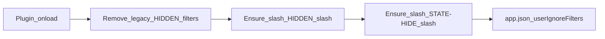
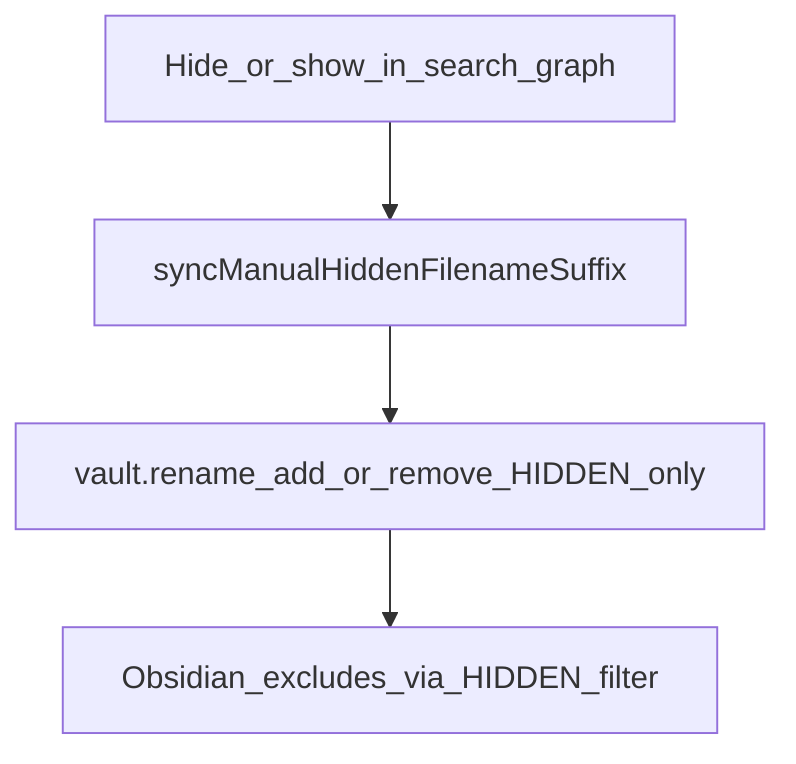
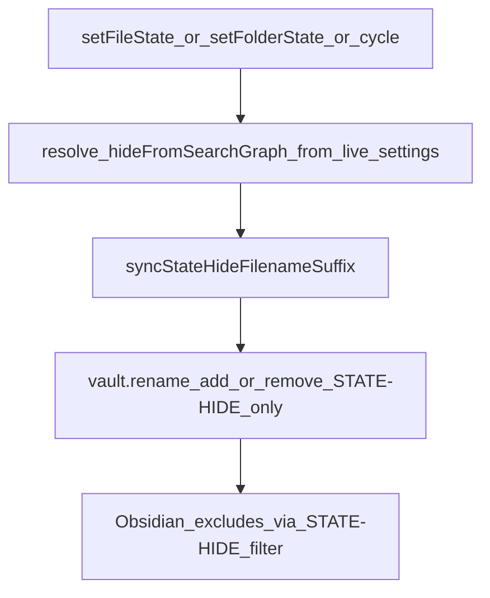

# Hide from search and graph

This page explains how Project Browser hides notes, pages, folders, and projects from Obsidian’s **Search** and **Graph view** using filename suffixes, while keeping them browsable in the Card Browser and page menus.

## Why it exists

Obsidian’s **Excluded files** list (`userIgnoreFilters`) excludes matching paths from search and graph. Project Browser uses that mechanism so users can hide items without deleting them or losing project-browser navigation.

The plugin also needs a clear in-app signal: hidden items should look different from normal items, but labels should not show raw suffix markers in cards, breadcrumbs, or FAB titles.

Two hide mechanisms coexist without overwriting each other:

- **Manual hide** (context menu) — `[HIDDEN]`
- **State-driven hide** (when a state has **Hide from search/graph** enabled) — `[STATE-HIDE]`

A note can carry both suffixes, e.g. `Note [STATE-HIDE] [HIDDEN]`. Changing state only toggles `[STATE-HIDE]`; the context menu only toggles `[HIDDEN]`.

## Conceptual understanding

### What “hidden from search/graph” means

- **On disk:** the file or folder basename may end with ` [HIDDEN]`, ` [STATE-HIDE]`, or both (state marker before manual marker).
- **In Obsidian:** the vault’s Excluded files list includes **`/\[HIDDEN\]/`** and **`/\[STATE-HIDE\]/`** — unanchored regexes that match any path containing those markers (markdown, canvas, base, attachments, folders).
- **In Project Browser:** the item remains visible and navigable; only search/graph exclusion changes.

This is separate from **hidden states** (Card Browser section visibility) and **Hide folder** (Project Browser’s PBS hide flag).

### Manual vs state hide

| Trigger | Suffix | Context menu label | Sync path |
|---------|--------|-------------------|-----------|
| Context menu **Hide from search/graph** | `[HIDDEN]` | Based on manual suffix only | `setFileHiddenFromSearchGraph` / `setFolderHiddenFromSearchGraph` |
| State with `hideFromSearchGraph: true` | `[STATE-HIDE]` | N/A (automatic on state apply) | `syncFileHiddenFilenameForState` / `syncFolderHiddenFilenameForState` |

Context menus use `basenameHasHiddenSuffix()` so a state-hidden item still shows **Hide from search/graph** until the user manually hides it. UI accent styling uses `basenameIsHiddenFromSearchGraph()` so either suffix triggers the muted treatment.

### Display names vs on-disk names

UI labels strip `[HIDDEN]`, `[STATE-HIDE]`, and `[DRAFT]` suffixes via:

- `getFileDisplayName()` / `getFileDisplayNameParts()` for files
- `getFolderDisplayName()` for folders
- `getAbstractFileDisplayName()` for mixed lists (e.g. card search)

**Rename modals** intentionally show the raw on-disk name so users can edit suffixes directly.

### Visual treatment

Items with either hide suffix in the path get the CSS class `ddc_pb_hidden-from-search-graph`:

- **Idle surfaces** (cards, folder buttons, page menu buttons, breadcrumb segments): background pushed toward the theme extreme — near-black in dark mode, near-white in light mode (`color-mix` on `--color-base-00`).
- **Selected hidden page** in the pages menu: muted active fill (accent mixed toward black/white) instead of full accent.
- **Low-priority cards** that are also hidden: keep full opacity so the background treatment reads clearly.

Styles live in `src/shared/search-graph-hidden.scss`, imported by card, folder, FAB, sidebar, and breadcrumb SCSS.

## Flows

### Plugin load — ensure Excluded files entries

On load, `ensureHiddenMarkdownIgnoreFilter()` in `src/main.ts`:

1. Removes legacy `[HIDDEN]` entries (`[HIDDEN].md`, `/\[HIDDEN\]\.md/`).
2. Adds **`/\[HIDDEN\]/`** and **`/\[STATE-HIDE\]/`** if missing (exact-match dedup per filter).

### Manual hide or show (context menu)

### State-driven hide (state apply or cycle)

State sync resolves `hideFromSearchGraph` from **live plugin settings** (`getStateByNameForFile` / `getStateByName`) so context-menu state objects that omit the flag cannot block renames.

### Display name in UI

Any surface that shows a human label should use the display-name helpers, not raw `file.basename` or `folder.name`. Card browser search filters on display names so queries match the label users see, not the suffixed on-disk name.

## Technical details

| Area | Key files |
|------|-----------|
| Suffix constants, parse/rebuild/strip helpers | `src/logic/filename-suffixes.ts` |
| Manual vs state rename sync | `src/logic/sync-hidden-filename.ts` |
| Excluded files list read/write | `src/logic/obsidian-user-ignore-filters.ts` |
| Folder display labels | `src/logic/get-folder-display-name.ts` |
| File display labels | `src/logic/get-file-display-name.ts` |
| Hidden surface styling | `src/shared/search-graph-hidden.scss` |
| State toggle in state editor | `src/modals/state-settings-modal-base/state-settings-modal-base.ts` |
| Persist full state on edit | `src/components/state-editor/state-editor.tsx`, `src/components/project-page-state-editor/project-page-state-editor.tsx` |
| Default `hideFromSearchGraph` on Archived/Cancelled | `src/types/plugin-settings-migrations.ts` |

**Modified date:** hide/show uses a normal `vault.rename`. The plugin does **not** attempt to preserve `mtime` after rename (Obsidian’s timestamp APIs are unreliable for this).

## Technical gotchas

- **Plain `[HIDDEN].md` in Excluded files does not work** for nested or suffixed names. Obsidian compiles plain strings as start-anchored regexes. Use slash-wrapped **`/\[HIDDEN\]/`** and **`/\[STATE-HIDE\]/`** only.
- **Two suffixes, two filters** — both regexes must be present. State sync never strips `[HIDDEN]`; manual hide never strips `[STATE-HIDE]`.
- **Context menu checked state** reflects manual `[HIDDEN]` only. A state-hidden file without manual hide still offers **Hide from search/graph**, not **Show**.
- **State editor save** must merge the full edited state object (`Object.assign(stateInArray, modifiedState)`). Partial field copies dropped `hideFromSearchGraph` and broke state-driven renames.
- **Excluded files settings UI** snapshots the filter list when opened. After the plugin adds filters programmatically, Settings → Excluded files may still show “No exclusions added” until Settings is fully closed and reopened.
- **`config-changed` event:** notify with the key `'userIgnoreFilters'` (Obsidian 1.13+), not a bare event with no key.
- **Folder rename** adds suffixes to the folder name; descendant paths inherit markers for Obsidian’s path-based exclude filters.
- **Do not strip suffixes in rename modals** — users editing hide markers need the real basename.
- **Hidden vs PBS “Hide folder”:** `[HIDDEN]` / `[STATE-HIDE]` affect Obsidian search/graph; PBS hide affects Project Browser folder visibility — different flags and menus.

## Related

- [States and sections](states-and-sections.md) — visible vs hidden *states* (different concept)
- [Settings](settings.md) — display name helpers and aliases
- [Card Browser and navigation](card-browser-and-navigation.md) — breadcrumbs and FAB back labels
- [Testing](testing.md) — unit and E2E coverage for this feature
