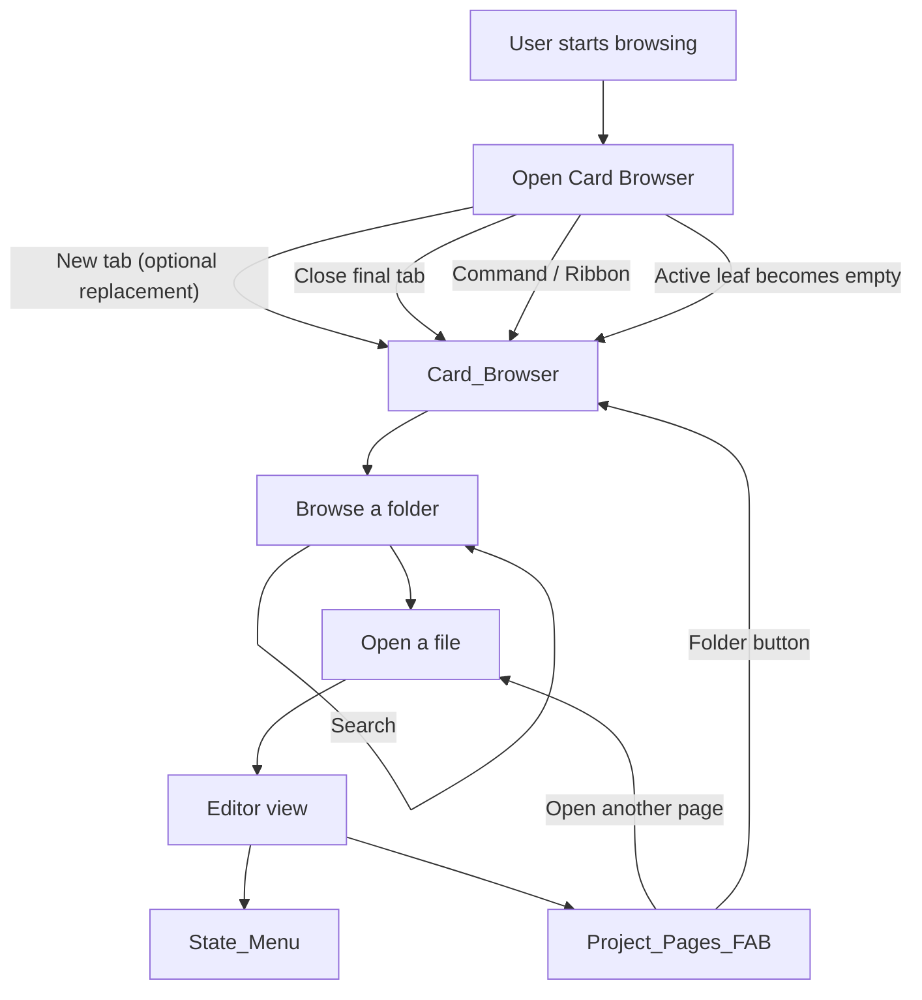

# Overview

This page explains **what Project Browser is** and **how its parts fit together**, without requiring you to understand Obsidian’s internal view system or the plugin’s code structure.

## Why it exists

Navigating a vault through folders and file trees is fast when you’re “thinking in paths”, but it can be high-effort when you’re tired, busy, or context-switching.

Project Browser replaces the “blank new tab” experience with a **low-friction browsing surface** where:

- You always feel like you’re “in” a folder
- Notes and projects are **grouped by state** (status)
- You can jump around quickly with **search**, **back**, and **breadcrumbs**

## Conceptual understanding

Project Browser has three user-visible “surfaces” that work together.

- **Card Browser**: A browsable view of a folder’s contents. It can replace new tabs, or you can open it via command/ribbon. It shows folders plus cards for notes and projects grouped by state.
- **State Menu (in-note)**: When you open a note, you can quickly assign it a state (or clear its state) without leaving the editor.
- **Project Pages FAB**: When any file is open (note, canvas, pdf, etc.), a floating action button lets you jump to other pages in the same project, add pages, or jump back to the folder in the Card Browser.

Two important concepts power the experience:

- **States**: Named statuses you assign to notes and projects (e.g. “Doing”, “Done”). Visible states become sections in the Card Browser; hidden states can be assigned but don’t display as sections.
- **Projects**: Folders that behave like notes. Instead of appearing in the “folders” row, a project folder appears as a **card** among notes, and it can have a state.

If you only remember one thing: **Project Browser helps you browse by meaning (state + “what I’m working on”) instead of by filesystem hierarchy.**

## Flows

### What happens when you open a folder in the Card Browser

- The Card Browser shows a **folders section** for navigable subfolders (unless a folder is a project).
- It shows **state sections** for notes and projects that have a state.
- It shows a **No status** section for items without a state.

### What happens when you open a file

- You move to Obsidian’s normal editor/file view for that file.
- Project Browser adds lightweight overlays:
  - The **State Menu** (for notes)
  - The **Project Pages FAB** (for any open file type Obsidian can display)

## Technical details

- The plugin registers a dedicated Card Browser view, plus editor-side enhancements, during plugin load.
- Browser startup routes through a single Card Browser view-state path whether it is opened from the command, the ribbon button, a new empty tab, or the workspace collapsing down to an empty leaf.
- New-tab replacement (when enabled) watches for empty active leaves and replaces them with the Card Browser.
- The startup recovery also listens for layout changes so the browser can re-open when the current leaf becomes empty without a separate leaf switch event.

For the browsing mechanics, sectioning, and navigation model, see:

- [Card Browser and navigation](card-browser-and-navigation.md)
- [States and sections](states-and-sections.md)
- [Projects](projects.md)
- [Project Pages FAB](project-pages-fab.md)

## Technical gotchas

- **New-tab replacement is conditional**: it only replaces leaves that are truly “empty”. If a leaf already contains a file view, the plugin will not replace it.
- **The final-tab-close path matters**: one startup route depends on the workspace ending up with an empty active leaf after the last tab closes. Testing this behaviour requires actually closing the final active tab, not just opening another empty leaf.
