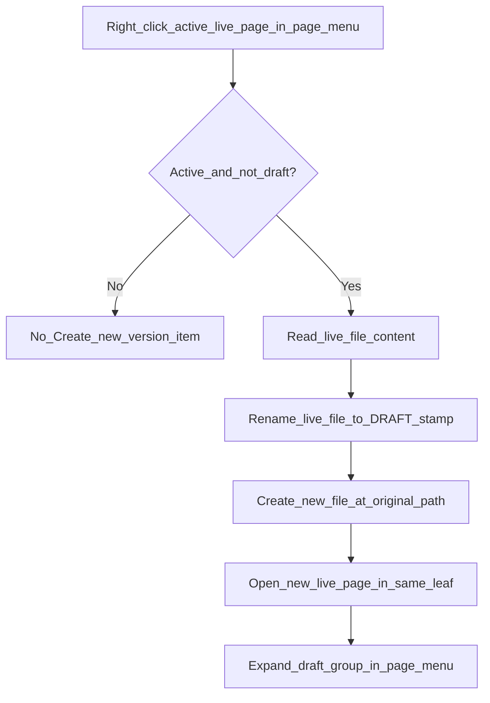
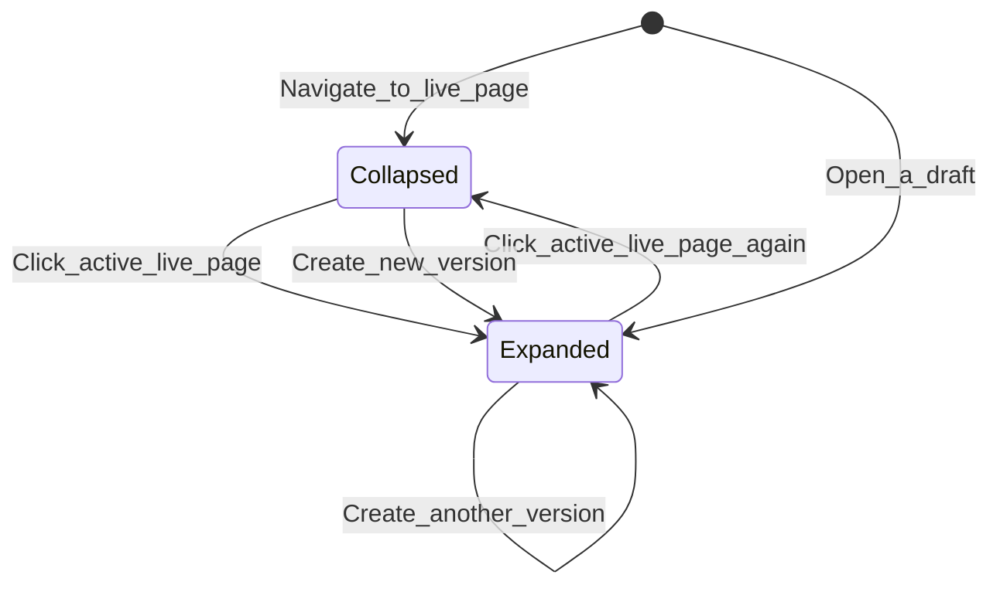

# Page versions

This page explains how Project Browser creates dated draft snapshots of project pages, nests them under the live page in the page menu, and keeps them out of the Card Browser while remaining reachable from the FAB and sidebar page lists.

## Why it exists

Writers often want to keep prior drafts of a page without cluttering the project browse view or Obsidian search/graph. **Create new version** snapshots the current page content as a historical file, then leaves a fresh live page under the original name so you can keep editing without losing the previous text.

## Conceptual understanding

- **Live page** — The current file at the project page name (e.g. `My Page.md`). This is what you edit and what supplies the project excerpt when no other source is set.
- **Draft version** — A renamed copy of a prior live page, with a `[DRAFT]` suffix and an embedded date/time stamp (e.g. `My Page - 2024.2.6 - 9.45am [DRAFT].md`). Drafts keep their original created/modified times from before the rename.
- **Page menu group** — In the Project Pages FAB and sidebar, each live page and its drafts render as one collapsible group instead of flat siblings.

Draft versions use the same muted “hidden” styling as `[HIDDEN]` items in the page menu, but they are hidden more aggressively than manual hide: they are **excluded from the Card Browser** as well as Obsidian search/graph.

## Flows

### Create new version

1. Right-click the **active live page** in the Project Pages FAB or sidebar page menu.
2. Choose **Create new version** (separated from other items by a divider).
3. The plugin renames the current file to a draft basename, then creates a new file at the original path with the same content.
4. The new live page opens in the current leaf; the page menu expands (or stays expanded) to show the new draft row.

**Restrictions:**

- Only available from the **page menu** (not Card Browser context menus).
- Only on the **currently active live page** in that menu.
- Never on draft rows themselves.

### Page menu group interaction

- Selecting a live page starts **collapsed** (drafts hidden).
- When collapsed and drafts exist, a stacked accent plate behind the active button hints that more versions exist.
- Click the **active live page** to expand or collapse its drafts.
- Opening a draft auto-expands the group.
- Creating a version auto-expands (or keeps expanded) even if Obsidian briefly routes through the renamed draft during the operation.

### Draft filename format

Draft stamps follow the [designdebt.club typography convention](https://designdebt.club/the-typography-of-dates-times-filenames/) (June 2024):

- Date: `YYYY.M.D` (no leading zeros on month/day)
- Time: 24-hour hour + zero-padded minutes + `am`/`pm` (e.g. `13.01pm`)
- Separator between date and time: ` - `
- Same-minute collisions: ` (2)`, ` (3)`, … appended to the stamp

Example: `My Page - 2024.2.6 - 9.45am [DRAFT].md`

### Visibility

| Surface | Live page | Draft version |
|---------|-----------|---------------|
| Card Browser | Shown | **Hidden** |
| Page menu (FAB / sidebar) | Shown | Shown (nested under live page) |
| Obsidian search / graph | Shown | Hidden when **Hide drafts from search/graph** is on (default) |

Draft hide uses Obsidian’s **Excluded files** list (`userIgnoreFilters`) with **`/\[DRAFT\]/`**, same mechanism as `[HIDDEN]` and `[STATE-HIDE]`. See [Hide from search and graph](hide-from-search-graph.md#draft-versions-draft) for persistence details.

## Technical details

| Area | Key files |
|------|-----------|
| Create version (rename + recreate) | `src/logic/create-page-version.ts` |
| Draft basename format / parse | `src/logic/filename-suffixes.ts` |
| Group live + draft files for menus | `src/logic/project-page-menu-groups.ts` |
| Group UI (expand/collapse, stack hint) | `src/components/project-page-menu-group/` |
| Page menu button + context menu attrs | `src/components/project-page-menu-file-button/` |
| Create new version menu rules | `src/context-menus/file-context-menu.tsx` |
| Exclude drafts from browse sections | `src/logic/folder-processes.ts` (`basenameHasDraftSuffix`) |
| Excluded files ensure + disk sync | `src/logic/obsidian-user-ignore-filters.ts`, `src/main.ts` |
| Settings toggle | `src/tabs/settings-tab/settings-tab.ts` (`hideDraftsFromSearchGraph`) |

Context menu handlers resolve the target file from `data-pb-file-path` on each open so **Create new version** still works after the first rename/recreate cycle (stale `TFile` refs would otherwise point at the draft).

## Technical gotchas

- **Rename preserves history timestamps** on the draft file; only the basename changes. The new live file is a fresh create at the original path.
- **Do not offer Create new version on drafts** — `basenameHasDraftSuffix` guards both `createPageVersion` and the context menu.
- **Card Browser filtering is explicit** — `[HIDDEN]` pages still appear as muted cards; `[DRAFT]` pages are filtered in `getSortedSectionsInFolder` / `getSortedSectionsInFolderAsync`.
- **Excerpt source lists** use `getSortedMarkdownPagesInProjectFolder`, which excludes drafts so a version snapshot cannot become the project card excerpt.
- **Orphan drafts** (live page deleted but drafts remain) still appear as a group keyed by stem, with the newest draft as the primary row when no live file exists.

## Testing

Automated coverage for page versions lives in unit/component specs and `page-versions.e2e.ts`. See [Testing](testing.md) for how to run them.

| Layer | Key specs | What they verify |
|-------|-----------|------------------|
| Unit | `create-page-version.test.ts` | Rename-to-draft + recreate-live flow, same-minute `(2)` collision, guards on draft files |
| Unit | `project-page-menu-groups.test.ts` | Draft nesting under live stems, orphan groups, newest-first ordering |
| Unit | `project-excerpt-source.test.ts` | Draft rows excluded from excerpt-source candidate lists |
| Unit | `file-context-menu.test.tsx` | **Create new version** only on the active live page in the page menu; opens the recreated live file |
| Unit | `filename-suffixes.test.ts`, `obsidian-user-ignore-filters.test.ts` | `[DRAFT]` basename detection and `app.json` Excluded-files sync |
| Component | `project-page-menu-group.test.tsx` | Collapsed-by-default groups and auto-expand when a new draft appears |
| E2E | `page-versions.e2e.ts` | Vault snapshot shape, Card Browser exclusion, FAB draft row visibility after expand |

**E2E note:** The spec seeds a draft via Obsidian vault APIs (rename + recreate) rather than clicking **Create new version** in the FAB. That menu path is covered by unit tests; WebdriverIO could not reliably open the context menu on the *active* FAB page row during automation.

## Related

- [Project Pages FAB](project-pages-fab.md) — where grouped page menus appear in the editor
- [Hide from search and graph](hide-from-search-graph.md) — `[DRAFT]` Excluded files integration
- [Settings](settings.md) — **Hide drafts from search/graph** toggle
