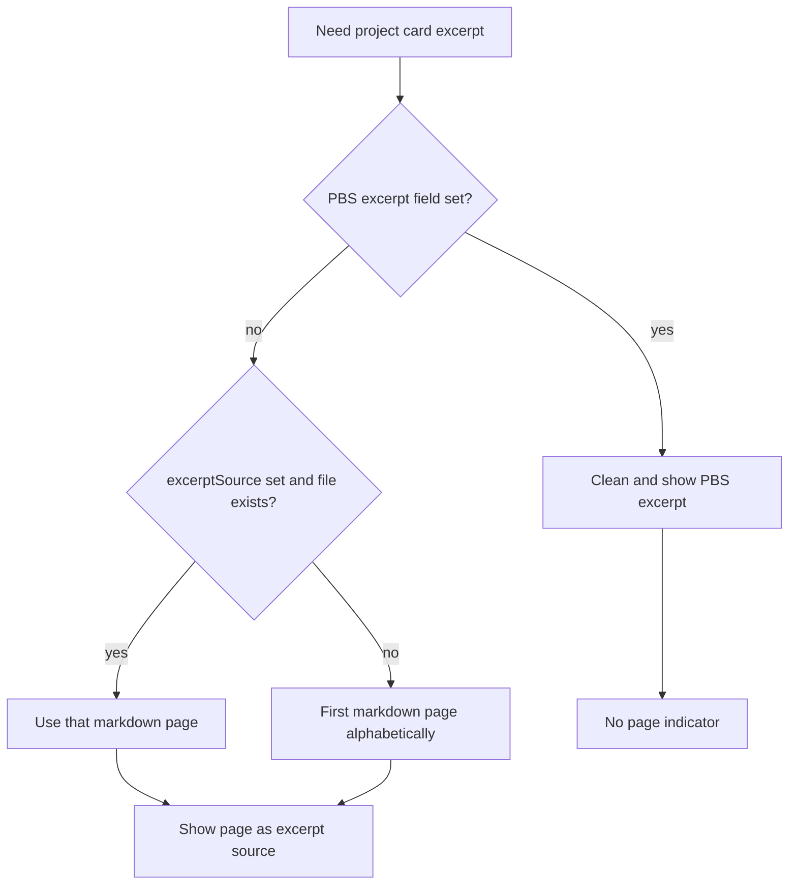

# Project excerpt source

Reference for how project cards choose their preview text, and how the active excerpt page is marked in the Card Browser and page menu.

## Why it exists

A project folder contains many files, so a project card cannot simply show “the note’s content” the way a single-note card can. Without an explicit rule, it was unclear which page fed the card preview. This feature picks a **markdown** page as the excerpt source (first alphabetically by default, or a user-chosen page) and makes that choice visible so you can tell at a glance which page the project card is summarizing.

## Conceptual understanding

- **Excerpt source** — The markdown page whose body is used for the project card’s blurb (after the same frontmatter/markdown cleanup as note excerpts).
- **Default** — When no source is assigned, the first markdown page in page-menu sort order (natural alphabetical) is used.
- **Assigned source** — Right-click a markdown page inside a project → **Set as excerpt source**. Choosing the same page again clears the assignment and returns to the alphabetical default.
- **PBS `excerpt` field** — Optional markdown stored on the project itself in `folder-settings.pbs`. When non-empty, it overrides any page source for the card preview (intended for later synthesized summaries). In that case, no page shows the excerpt-source indicator.
- **Markdown only** — Canvas, PDF, and other page-menu types cannot be set as excerpt sources and are never used for the default.

## Flows

### Assign or clear a source

1. Open a project (Card Browser or page menu / note cards inside the project).
2. Right-click a **markdown** page.
3. Choose **Set as excerpt source** (checked when that page is already assigned).
4. The choice is written to `folder-settings.pbs` as `excerptSource` (the file’s name, e.g. `Page 2.md`).
5. Clicking the same item again clears `excerptSource`.

## Visual indicators

| Surface | Marker |
|--------|--------|
| Card Browser note card | 1px `--interactive-accent` line along the **top-right 20px** |
| Page menu (FAB / sidebar) | 1px accent line on the **right** edge; when that page is also the selected (filled accent) row, the line is **white** so it stays visible |

The indicator follows the **effective** page source (assigned or alphabetical default). It is hidden when the PBS `excerpt` field supplies the preview.

## Technical details

- Types: `FolderSettings_0_1_2.excerptSource?: string`, `excerpt?: string` (`src/types/folder-settings_0_1_2.ts`).
- Resolution: `getProjectExcerpt` (`folder-processes.ts`) and `resolveProjectExcerptSourceFile` (`project-excerpt-source.ts`).
- Persistence: `setFolderExcerptSource` writes PBS and calls `refreshFileDependants`.
- Card outline refresh: cards are keyed by file path, so changing PBS does not remount them. `NoteCardBase` re-checks on `CardBrowserContext.refreshId`, and context-menu `onFileChange` calls `rerender()` so every card updates the outline without leaving the view.
- Page menu: FAB and sidebar resolve the excerpt source path once per list refresh and pass `isExcerptSource` into `ProjectPageMenuFileButton`.

## Technical Gotchas

- **Markdown only** — Non-`.md` files never get the context-menu action or the indicator; alphabetical default skips them.
- **Stale outlines without rerender** — Updating `isExcerptSource` only in the clicked card’s local state would leave the previous source outlined. Always bump browser `refreshId` (via `rerender` / file dependants) so all cards re-resolve.
- **PBS `excerpt` vs page source** — A populated `excerpt` field wins for preview text and suppresses the page indicator even if `excerptSource` is still set.
- **Name matching** — `excerptSource` stores `file.name` and matches by name or basename within the project’s page-menu file list.

## Related

- [Projects](projects.md) — Project conversion and PBS overview.
- [Project Pages FAB](project-pages-fab.md) — Page list where the right-edge indicator appears.
- [Card Browser and navigation](card-browser-and-navigation.md) — Where project cards and note cards render.
