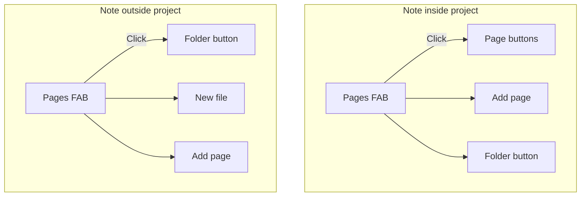

# Project Pages FAB

Reference for the Project Pages floating action button (FAB) shown when editing a note in the editor.

## Why it exists

When working in a project, you often need to jump between its pages. The Project Pages FAB provides quick navigation to other pages in the same project without leaving the note view. It also appears when viewing notes outside a project, offering actions to create projects or add files. It appears in the same bottom-right position as the project browser FAB for consistency.

## Conceptual understanding

- **Project Pages FAB** — A floating button with a pages icon that appears whenever any file that Obsidian can display is open (markdown, PDF, canvas, images, etc.). Its menu varies: for files inside a project, it shows other project pages and an Add page action; for files outside a project, it shows Folder, New file, and Add page.
- **Pages** — The direct file children of the project folder (excluding `folder-settings.pbs`). Notes in subfolders of a project are not included.

## Flows and relationships

### When the FAB appears

1. You open a file (markdown, PDF, canvas, image, etc.) in the editor.
2. The FAB appears in the bottom-right corner for any open file view, whether inside a project or not.
3. If the note’s parent folder is `null` (e.g. file at vault root), the vault root is used for folder actions.

### Using the FAB — note inside a project

1. Click the FAB to open the pages menu.
2. Other project pages appear as floating buttons above the FAB.
3. **Add page** — creates a new file in the project and opens it.
4. **Folder** (labeled with the project folder name) — opens that folder in the project browser.
5. Click a page to navigate to it. The state menu on that page opens by default.
6. Click the FAB again or click anywhere else to close the menu.

### Using the FAB — note outside a project

1. Click the FAB to open the menu.
2. **Folder** — opens the note’s parent folder in the project browser.
3. **New file** — creates a new markdown file in the parent folder and opens it.
4. **Add page** — creates a project and moves the current note into it, then adds a second page and opens it. The note becomes the first page; the new file is the second.

### Add page (note outside project) flow

1. A new subfolder is created in the note’s parent, named from the note’s basename (or with `(2)`, `(3)`, etc. if a conflict exists).
2. The current note is moved into that folder.
3. The folder is marked as a project (`folder-settings.pbs` with `isProject: true`).
4. A second page (new file) is created in the project folder.
5. The second page opens in the same leaf.

### Visual feedback

- When the menu is open, the FAB is highlighted (accent color) so you know it can be clicked again to close.

## Technical implementation

- **Component**: `ProjectPagesFAB` in `src/components/project-pages-fab/`
- **Integration**: Rendered from `registerMarkdownViewMods` whenever the active leaf shows a file view (any type Obsidian can display). Parent folder is `activeFile.parent ?? vault.getRoot()`.
- **Page list**: Derived from `getItemsInFolder(projectFolder)` — filtered to `TFile`, filtered by visible file types (`isExtensionVisible`), sorted by name.
- **Page button labels**: Use `getFileDisplayNameParts()`, which respects the "Show extension for non-document files" setting. The extension portion is faded with `--text-faint`. Only canvas and base files show a type tag (CANVAS, BASE) at the top-right of each button; other file types do not.
- **Context menu**: Right-click a page button for the same file-type-specific options as the card browser: Open in new tab, Priorities/States (notes only), Rename, Delete. See [file-type-visibility.md](file-type-visibility.md) for details.
- **Navigation**: Uses `openFileInSameLeaf` followed by `openStateMenuIfClosed`.
- **Add page (non-project)**: `createProjectFromNote` in `src/utils/file-manipulation.ts` — creates folder, moves note, sets project, creates second page.
- **Click-outside close**: `pointerdown` on `document`; closes when the target is outside the FAB/buttons container.

## Technical gotchas

- **Mouse back button (Canvas/Base)** — Obsidian has known navigation-history bugs with Canvas and Base files. When the back button fails to return to the project browser (e.g. shows a blank page), use the FAB’s **Folder** button instead. See [known-issues-and-attempted-fixes.md](known-issues-and-attempted-fixes.md) for technical context and attempted solutions.
- **Empty or single-page projects** — The FAB still appears; the page list is simply empty when there are no other pages.
- **Notes in subfolders** — Only notes whose **direct parent** is the project folder see the project menu. Notes inside subfolders of a project do not.
- **Note at vault root** — `activeFile.parent` may be null; the vault root folder is used for all folder actions.
- **Folder name conflict** — When creating a project from a note, if a sibling folder with the same name exists, `(2)`, `(3)`, etc. are appended.
- **Embed content** — Clicks inside transcluded or embedded content close the menu, since those elements are part of the document and the `pointerdown` target is outside the FAB.
