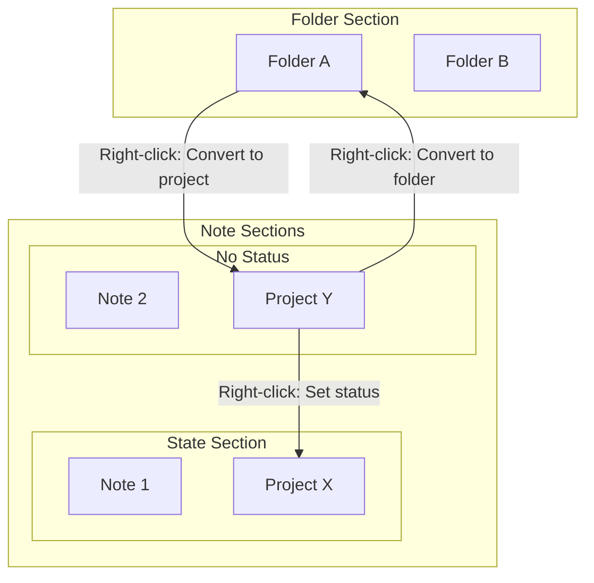

# Projects

Reference for the Projects feature: folders that appear as cards among notes with assignable status.

## Why it exists

By default, folders appear in the folder section and are navigated into like directories. Some folders represent "projects"—collaborations, initiatives, or topics that behave more like notes: they have a status, appear alongside other content, and are grouped by state. The Projects feature lets you promote any folder to a project so it is displayed as a card among notes instead of in the folder list.

## Conceptual understanding

- **Folder** — A standard folder that appears in the folder section. Right-click to navigate into it or perform folder actions (hide, rename, delete).
- **Project** — A folder marked as a project. It no longer appears in the folder section; it appears as a card among notes, grouped by state (or in the no-status section if it has no status). Projects can have a status, are styled like note cards but with a thicker top border, and open like folders when clicked.

Converting a folder to a project does not move or rename anything. It only changes how the folder is displayed and where its status is stored.

## Flows and relationships

### Converting folder to project

1. Right-click a folder in the folder section, or right-click the background when viewing a folder’s contents.
2. Choose **Convert to project**.
3. The folder is saved as a project with no status.
4. It disappears from the folder section and appears in the no-status (stateless) section among notes.

### Converting project back to folder

1. Right-click the project card (wherever it appears among notes).
2. Choose **Convert to folder**.
3. The folder returns to the folder section.

### Assigning status to a project

1. Right-click a project card.
2. Choose a state from the menu (Visible states or Hidden states).
3. The project moves to that state’s section.
4. Choosing the same state again clears the status (returns to no-status section).

## Technical implementation

- Project status is stored in `folder-settings.pbs` inside each folder.
- `FolderSettings_0_1_2` defines `isProject?: boolean` and `stateName?: string`.
- `stateName` matches `StateSettings.name`; when absent, the project is stateless.
- Project cards match note card styling, with a thicker top border for visual distinction.
- Section building is async (`getSortedSectionsInFolderAsync`) because it reads folder settings from disk.

## Technical gotchas

- **Empty folders** — An empty folder can be a project. It will appear in the no-status section.
- **folder-settings.pbs** — This file is created inside the folder when you convert to project or change status. It is excluded from the note list.
- **Search** — Projects are filtered by name like notes when using the search field.

## Related

- [States and sections](states-and-sections.md) — How visible/hidden states and the No status section work.
- [Project Pages FAB](project-pages-fab.md) — Floating action button for quick navigation between pages when viewing a note inside a project.
