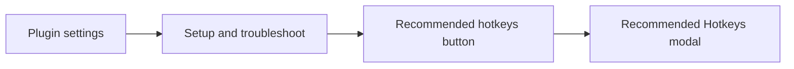
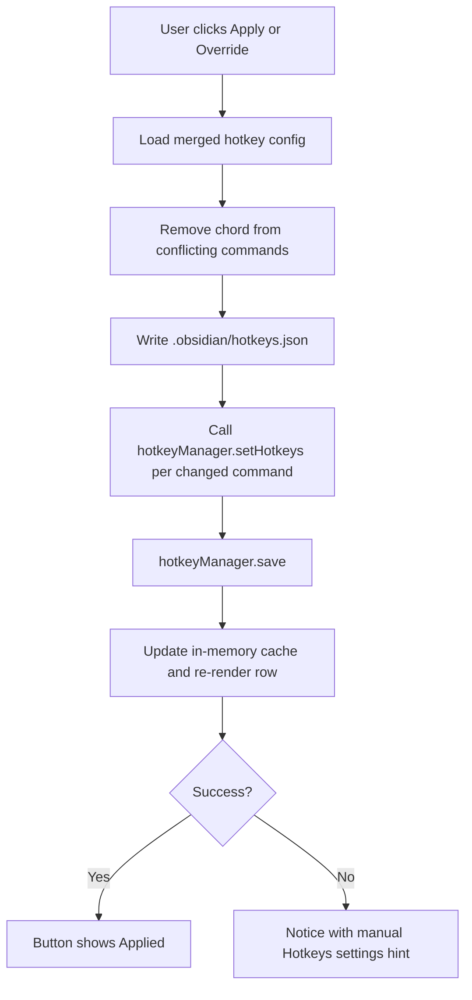

# Recommended hotkeys

Guide to the in-plugin flow for reviewing and applying Project Browser shortcut recommendations.

## Why it exists

Obsidian no longer ships default hotkeys for third-party plugins. Project Browser still relies on a small set of shortcuts for the state menu and state cycling, so the plugin exposes **recommended** chords users can apply when they do not conflict with existing bindings.

The modal lets users apply shortcuts **one at a time**, see conflicts before overriding, and refresh the row immediately after a successful apply—without opening Obsidian’s global Hotkeys settings.

## Conceptual understanding

Three commands share the same mental model across **projects, notes, and pages**:

| Action | Command | Recommended chord |
|---|---|---|
| Show or hide the state menu | Toggle state menu | Mod+Shift+S |
| Move to the previous state | Apply previous state | Mod+Shift+Left arrow |
| Move to the next state | Apply next state | Mod+Shift+Right arrow |

State cycling uses whichever state list applies to the **active file** (standard note states vs project page states). Command names in the modal are hardcoded so they stay generic; they are not prefixed with “Project Browser:” like Obsidian’s command palette labels.

In the modal UI, **Mod** is shown as **Command** on macOS and **Control** on Windows and Linux.

## Flows

### Open the modal

The button sits on the same row as “View recent changes” and “Rewatch welcome tips”. It is available on mobile as well (for example iPad with an external keyboard).

### Apply one recommendation

Each row shows:

1. **Line 1:** action name (e.g. “Toggle state menu”)
2. **Line 2:** accent-colored chord, then a faint status in brackets—`(No conflict found.)`, `(Already applied.)`, or a conflict message

## Technical details

- **Entry point:** `Recommended hotkeys` button in `insertSetupTroubleshootSection()` (`src/tabs/settings-tab/settings-tab.ts`).
- **Modal:** `RecommendedHotkeysModal` (`src/modals/recommended-hotkeys-modal/recommended-hotkeys-modal.ts`).
- **Recommendations:** `RECOMMENDED_HOTKEYS` constant maps command IDs to display names and chord definitions.
- **Persistence:** writes vault `.obsidian/hotkeys.json` via `vault.adapter`, then syncs runtime through Obsidian’s `hotkeyManager`.
- **Conflict detection:** scans all commands in the merged config; matching chords on other commands surface as `(Conflicts with …)`.
- **Override behaviour:** applying a recommendation removes that chord from any other command first, then assigns it to the Project Browser command.
- **Command registration:** `src/commands/toggle-state-menu.ts` and `src/commands/cycle-state.ts` register the underlying commands; cycle commands call `getStateSettingsForFile()` so scope follows the active file.

## Technical Gotchas

- **`hotkeyManager.customKeys` is read-only** in current Obsidian builds. Assigning to it throws and breaks apply + modal refresh. Sync must use `setHotkeys(commandId, hotkeys)` for each changed command, then `save()`.
- **Display names vs Obsidian names:** the modal must use `commandName` from `RECOMMENDED_HOTKEYS`, not `app.commands`, or rows pick up the “Project Browser: …” prefix.
- **Modifier normalization:** persisted hotkeys may use `Mod`, `Ctrl`, or `Meta`. Compare with normalized modifiers and uppercase single-character keys when detecting “Already applied.”
- **In-memory cache:** after apply, `hotkeyConfig` is updated before re-render so the row reflects the new state without closing the modal.
- **Failure notice:** on error, the user sees a notice ending with: “If this persists, edit the hotkeys manually in the Obsidian Hotkeys settings.”

## Related

- [Settings](settings.md)
- [States and sections](states-and-sections.md)
