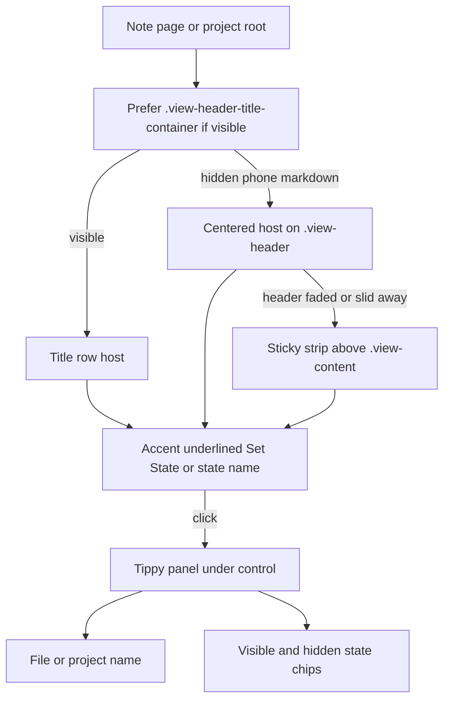

# State menu in the view header

How users set note, page, and project state from the Obsidian leaf header (and Tippy picker).

## Why it exists

State used to sit in the content area (and briefly in the project breadcrumb), which stole vertical space and felt inconsistent across surfaces. Putting the closed control in the leaf header keeps state assignment in the same place for notes, pages, and project roots, without an in-flow strip under the header.

On phone, Obsidian often hides the title row for markdown (inline title in the note body) or slides the whole header away. The control still needs a visible home, and the picker needs the file/project name when the title is not on screen.

## Conceptual understanding

- **Closed control** — Plain accent-colored, underlined text showing the current state name or **Set State**. No button chrome (no background, padding, or outline chip).
- **Header placement (wide / desktop)** — Host sits in Obsidian’s `.view-header-title-container` with the leaf title.
- **Header placement (phone markdown)** — When the title container is hidden, the control is centered in the remaining view-header bar. If the header itself is faded/slid away (`is-hidden-nav`), a slim sticky strip above the note content holds the centered control.
- **Project leaf title** — Non-project Card Browser leaves keep the title **Browse**. Entering a project root replaces that title with the project name and shows the header state control **under** the project name (stacked), not beside it.
- **Picker** — Clicking the closed control opens a Tippy panel under the control with the subject name (file or project) at the top, then visible and hidden state chips. Choosing a state (or clearing by clicking the current one) closes the panel. After a choice, the closed control flashes white text, then eases back to accent (no background flash).

## Flows

### Notes and project pages

1. Open a markdown note or project page.
2. On desktop/tablet, the closed state control appears in the title row beside the file title.
3. On phone with inline title, the title row is hidden — the control appears centered in the header chrome (or in the sticky strip if the header is hidden).
4. Click it to open the Tippy picker (subject name at the top); pick a state or click the current state to clear.

### Project roots in the Card Browser

1. Browse a non-project folder — leaf title stays **Browse**; no header state control.
2. Enter a project folder — leaf title becomes the project name on its own line; the closed state control sits on the line below (centered on phone).
3. Breadcrumbs remain navigation only (no state chip in the trail).
4. Click the header control to set or clear the project folder’s state.

## Technical details

- **Shared shell:** `StateMenuShell` (`src/components/state-menu/state-menu-shell.tsx`) renders the closed control and Tippy choices for notes, pages, and project folders. Optional `subjectLabel` (file basename or project/folder name) is shown at the top of the Tippy content.
- **Shared portal helper:** `ensureStateMenuHeaderButtonContainer()` in `src/logic/state-menu-header-portal.ts` picks the host:
  1. Visible `.view-header-title-container` (adds `ddc_pb_has-state-menu-header` for project title stacking CSS)
  2. Else usable `.view-header` with `--chrome` (absolute-centered)
  3. Else sticky `--sticky` at the top of `.view-content`
- **Note/page wiring:** `addStateHeader()` in `src/views/markdown-view-mods/markdown-view-mods.tsx` calls the helper and re-runs on `layout-change` so phone chrome hide/show relocates the host. Empty stale hosts are removed after relocate.
- **Project wiring:** `ProjectCardsView` uses the same helper while browsing a project; leaving a project calls `clearStateMenuHeaderButtonContainer()` so the host and stack marker disappear for **Browse**.
- **Title sync:** `getDisplayText()` returns the project name or `Browse`. Because Obsidian often does not re-poll that after in-view navigation, `applyDisplayTitleToDom()` also writes the tab title and `.view-header-title`.
- **Closed style:** `.ddc_pb_state-btn.ddc_pb_in-closed-menu` is text-only (transparent background, zero padding). Set-state feedback uses `highlight-and-fade` (white → accent).
- **Tippy:** Controlled `visible` / `menuIsActive`, `placement="bottom"`, `interactive`, appended to `document.body`. Panel uses a large border radius to match chip rounding. Content max width is the viewport width minus a gutter (computed in JS on open). `preventOverflow` against the viewport shifts an off-center panel so it stays on screen.
- **Mount host:** The React `.ddc_pb_state-menu` root stays height `0`; choices live only in Tippy.

## Technical Gotchas

- **Phone markdown hides the title container** — Selector `.is-phone.show-inline-title … .view-header-title-container { display: none }`. Do not assume the title-row host is always visible; use the shared portal helper.
- **Phone `is-hidden-nav` keeps the header in layout** — Opacity can be `0` while the element still has a non-zero box. Treat low opacity / off-screen bottom as “header unusable” and fall back to sticky.
- **Center chrome on `.view-header`, not `.view-header-left`** — Left chrome keeps the control left-aligned; absolute centering needs the full header as containing block.
- **Do not put project state back in the breadcrumb** — Header parity with notes/pages is intentional; breadcrumbs are for path navigation only.
- **`getDisplayText()` alone is not enough** — After folder changes inside the Card Browser, sync the tab/header DOM or the title can stay stale as **Browse**.
- **Tippy appends to `body`** — Click-outside and width constraints must treat the Tippy box as outside the leaf DOM. Use Tippy’s `onClickOutside` and viewport `preventOverflow`, not only leaf-local pointer handlers.
- **Off-center header buttons** — Prefer shifting the panel inside the viewport over clipping or forcing a half-width leaf cap. The arrow stays aimed at the control while the box slides.
- **Surface visibility vs menu open** — Toggle-state-menu / cycle flash still use surface visibility for the closed control; Tippy open state (`menuIsActive`) is separate and only changes on click (or after a choice).
- **Project title stacking uses an explicit class** — `ddc_pb_has-state-menu-header` on the title container (not `:has()` alone) so Card Browser can reliably stack project name above Set State.

## Related

- [States and sections](states-and-sections.md)
- [Projects](projects.md)
- [Overview](overview.md)
