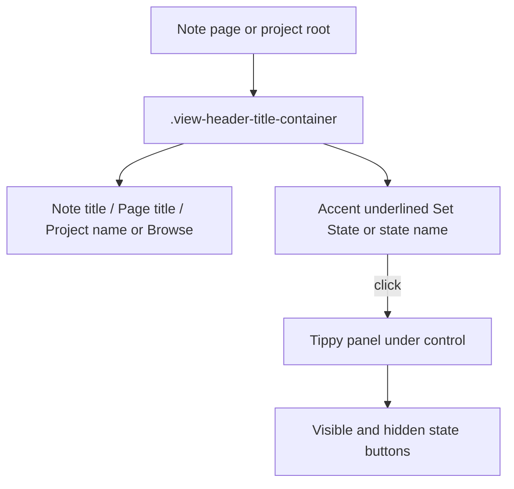

# State menu in the view header

How users set note, page, and project state from the Obsidian leaf title row.

## Why it exists

State used to sit in the content area (and briefly in the project breadcrumb), which stole vertical space and felt inconsistent across surfaces. Putting the closed control next to the leaf title keeps state assignment in the same place for notes, pages, and project roots, without an in-flow strip under the header.

## Conceptual understanding

- **Closed control** — Accent-colored, underlined text showing the current state name or **Set State**. No outline chip.
- **Header placement** — The closed control lives in Obsidian’s `.view-header-title-container`, beside the leaf title.
- **Project leaf title** — Non-project Card Browser leaves keep the title **Browse**. Entering a project root replaces that title with the project name and shows the same header state control.
- **Picker** — Clicking the closed control opens a Tippy panel under the control with visible and hidden state buttons (centered rows). Choosing a state (or clearing by clicking the current one) closes the panel.

## Flows

### Notes and project pages

1. Open a markdown note or project page.
2. The closed state control appears beside the file title in the view header.
3. Click it to open the Tippy picker; pick a state or click the current state to clear.

### Project roots in the Card Browser

1. Browse a non-project folder — leaf title stays **Browse**; no header state control.
2. Enter a project folder — leaf title becomes the project name; the closed state control appears beside it.
3. Breadcrumbs remain navigation only (no state chip in the trail).
4. Click the header control to set or clear the project folder’s state.

## Technical details

- **Shared shell:** `StateMenuShell` (`src/components/state-menu/state-menu-shell.tsx`) renders the closed control and Tippy choices for notes, pages, and project folders.
- **Note/page portal host:** `addStateHeader()` in `src/views/markdown-view-mods/markdown-view-mods.tsx` creates `.ddc_pb_state-menu-header-button-container` inside the markdown leaf’s `.view-header-title-container`.
- **Project portal host:** `ProjectCardsView` creates the same host class on the Card Browser leaf and passes it to `ProjectFolderStateMenu` via `CardBrowser`’s `closedButtonPortalContainer`.
- **Title sync:** `getDisplayText()` returns the project name or `Browse`. Because Obsidian often does not re-poll that after in-view navigation, `applyDisplayTitleToDom()` also writes the tab title and `.view-header-title`.
- **Closed style:** `.ddc_pb_state-btn.ddc_pb_in-closed-menu` uses accent color + underline (no outline).
- **Tippy:** Controlled `visible` / `menuIsActive`, `placement="bottom"`, `interactive`, appended to `document.body`. Content max width is the viewport width minus a gutter (computed in JS on open). `preventOverflow` against the viewport shifts an off-center panel so it stays on screen.
- **Mount host:** The React `.ddc_pb_state-menu` root stays height `0`; choices no longer expand an in-flow strip.

## Technical Gotchas

- **Do not put project state back in the breadcrumb** — Header parity with notes/pages is intentional; breadcrumbs are for path navigation only.
- **`getDisplayText()` alone is not enough** — After folder changes inside the Card Browser, sync the tab/header DOM or the title can stay stale as **Browse**.
- **Tippy appends to `body`** — Click-outside and width constraints must treat the Tippy box as outside the leaf DOM. Use Tippy’s `onClickOutside` and viewport `preventOverflow`, not only leaf-local pointer handlers.
- **Off-center header buttons** — Prefer shifting the panel inside the viewport over clipping or forcing a half-width leaf cap. The arrow stays aimed at the control while the box slides.
- **Surface visibility vs menu open** — Toggle-state-menu / cycle flash still use surface visibility for the closed control; Tippy open state (`menuIsActive`) is separate and only changes on click (or after a choice).

## Related

- [States and sections](states-and-sections.md)
- [Projects](projects.md)
- [Overview](overview.md)
