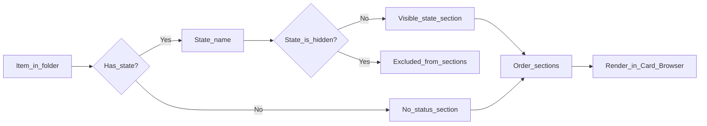

# States and sections

This page explains **how status (state) turns a folder into a readable dashboard**: notes and projects are grouped into sections so you can browse by “what stage is this in?” rather than by filename or folder structure.

## Why it exists

Project Browser’s main browsing surface is not just “a folder view”. It is a **state-organised view** of a folder’s contents.

If you don’t understand states, it’s hard to predict:

- why an item appears in one section vs another
- why some states appear as headings while others don’t
- why a “project” (folder) can show up alongside notes

## Conceptual understanding

### What is a state?

A **state** is a named status you can assign to:

- **Notes** (markdown files)
- **Projects** (folders marked as projects)

Common examples: “Doing”, “Waiting”, “Done”.

### Visible vs hidden states

States exist in two categories:

- **Visible states**: appear as section headings in the Card Browser. They are the “lanes” you browse by.
- **Hidden states**: can be assigned to items, but do not appear as their own sections. Hidden states are useful for metadata you want to preserve without cluttering the browser.

### No status (stateless)

If an item has **no state**, it appears in a dedicated section often labelled **No status** (sometimes called “stateless” in code/docs).

This is not an error state. It’s the default when you haven’t assigned anything yet.

### What is a “section”?

A **section** is a group shown in the Card Browser. There are three conceptual section types:

- **Folders**: navigable subfolders (except folders marked as projects)
- **State sections**: one section per visible state (plus sometimes additional non-state sections depending on context)
- **No status**: the group for items without a state

## Flows

### Where a state comes from

State is stored in different places depending on what you’re assigning it to:

- **Notes**: state is read from note metadata (frontmatter).
- **Projects**: state is stored inside the folder itself (a small settings file alongside the project’s pages).

The important part conceptually is that both notes and projects share the same **state names**, so they can be grouped together.

### How section ordering works

The Card Browser follows the plugin’s configured ordering:

- sections for **visible states** in their configured order
- a **Folders** section
- a **No status** section
- any other leftover sections (rare) are appended, but hidden states never appear as headings

## Technical details

- Section ordering is implemented in `src/logic/section-processes.ts` (`orderSections` and `getStateSettings`).
- The Card Browser builds sections from the current folder, then applies ordering and hidden-state filtering before rendering.

See also:

- [Card Browser and navigation](card-browser-and-navigation.md)
- [Projects](projects.md)

## Technical gotchas

- **Hidden states don’t show as sections**: items assigned a hidden state will not appear under a heading for that state.
- **Stateless has a special representation**: internally, the ordering uses a placeholder title for the “No status” section, but the UI presents it with a human label.
